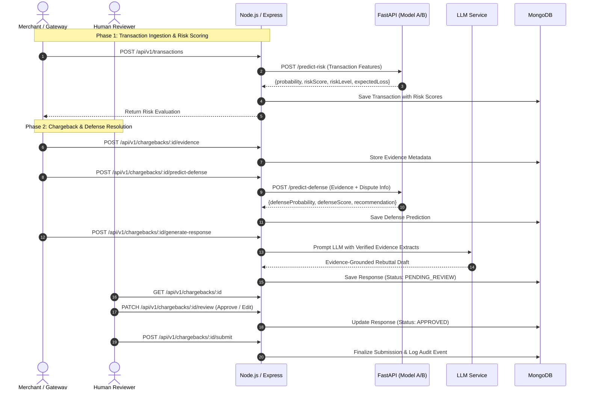

# AI Risk Manager — Project Specification

## 1. Project Goal
AI Risk Manager is an enterprise-grade merchant-loss reduction platform focused on chargeback prevention, risk assessment, and intelligent dispute defense.

The system features two core ML models:
1. **Model A (Transaction Chargeback Risk Prediction)**: Pre-chargeback risk assessment to forecast the likelihood of a chargeback and the expected merchant financial loss.
2. **Model B (Chargeback Defense Success Prediction)**: Post-chargeback evaluation to predict the likelihood of successfully disputing and recovering funds based on available evidence.

Additionally, the platform provides:
- Structured evidence management for dispute re-presentments.
- Verifiable, evidence-grounded chargeback response generation powered by an external LLM.
- Enforced human-in-the-loop review workflows before formal submission.
- Real-time and aggregate merchant loss analytics.
- Comprehensive audit trails and compliance logging.

---

## 2. User Roles & Access Control
External actors (customers, issuing banks, card schemes, payment processors) are not application users. The system supports four internal roles:

1. **`ADMIN`**: Full platform control, user and role management, audit log access, global loss analytics, system-wide configuration.
2. **`MERCHANT`**: Access to merchant-specific transactions, chargeback alerts, evidence upload portal, and loss reports.
3. **`RISK_ANALYST`**: In-depth transaction risk analysis, risk parameter configuration, model monitoring, and loss pattern discovery.
4. **`REVIEWER`**: Evidence inspection, LLM draft review, rebuttal adjustments, and human-in-the-loop approval/rejection for dispute responses.

---

## 3. Technology Stack

### Frontend
- **Framework**: React (v18+) with Vite
- **Routing**: React Router (v6+)
- **Styling**: Tailwind CSS
- **Icons**: Lucide React
- **HTTP Client**: Axios / Fetch API

### Backend Gateway
- **Runtime & Framework**: Node.js & Express.js
- **Database & ODM**: MongoDB & Mongoose
- **Authentication**: JSON Web Tokens (JWT) & bcrypt password hashing
- **Integration**: Axios for ML & LLM service communication

### ML Service
- **Framework**: Python 3.10+, FastAPI, Uvicorn
- **Data & ML Libraries**: pandas, numpy, scikit-learn, XGBoost, joblib
- **Validation**: Pydantic v2

### LLM Integration
- **Service**: Configurable external LLM provider accessed strictly via the Node.js backend.
- **Security**: API keys are strictly confined to the backend server environment.

---

## 4. Architectural Boundaries & Data Flow

```
[ React Client ]
       │  (HTTP / JSON + Bearer JWT)
       ▼
[ Node.js + Express Gateway ]
   ├──► [ MongoDB (Data Storage & State) ]
   ├──► [ FastAPI ML Service ] ──► [ Model A & Model B Artifacts ]
   └──► [ External LLM API ]
```

### Critical Rules
- React client communicates **only** with Express. It must never directly invoke FastAPI or LLM endpoints.
- Express handles auth, data persistence, orchestration, role enforcement, and proxying.
- Model metrics must strictly stem from real held-out evaluation datasets without synthetic fabrication or feature leakage.

---

## 5. Machine Learning Models

### Model A: Transaction Chargeback Risk Prediction
- **Trigger**: Real-time during transaction processing or batch ingestion.
- **Inputs**: Transaction metadata (amount, currency, card type, channel, IP/country geolocation, AVS/CVV verification result, customer velocity, historical behavior).
- **Outputs**:
  - `chargeback_probability`: Float $[0.0, 1.0]$.
  - `risk_score`: Integer $[0, 100]$.
  - `risk_level`: Categorical (`LOW`, `MEDIUM`, `HIGH`, `CRITICAL`).
  - `expected_loss`: Metric computed as:
    $$\text{expected\_loss} = \text{chargeback\_probability} \times \text{transaction\_amount}$$

### Model B: Chargeback Defense Success Prediction
- **Trigger**: Post-chargeback event, triggered when preparing dispute re-presentment.
- **Inputs**: Dispute reason code, transaction characteristics, evidence types present (proof of delivery, invoice, terms acknowledgement, communication logs, customer ID match score), merchant dispute history.
- **Outputs**:
  - `defense_success_probability`: Float $[0.0, 1.0]$.
  - `defense_score`: Score $[0, 100]$.
  - `recommendation`: Enum (`DEFEND`, `ACCEPT_LOSS`, `COLLECT_MORE_EVIDENCE`).

---

## 6. Database Entities (MongoDB Schemas)

1. **User**: `_id`, `name`, `email`, `passwordHash`, `role`, `merchantId`, `isActive`, `createdAt`, `updatedAt`
2. **Merchant**: `_id`, `name`, `industryCategory`, `riskTier`, `contactEmail`, `createdAt`
3. **Transaction**: `_id`, `merchantId`, `transactionId`, `amount`, `currency`, `cardType`, `channel`, `customerEmail`, `ipAddress`, `billingCountry`, `shippingCountry`, `avsResult`, `cvvResult`, `riskScore`, `riskLevel`, `chargebackProbability`, `expectedLoss`, `status`, `timestamp`
4. **Chargeback**: `_id`, `transactionId`, `merchantId`, `disputeId`, `reasonCode`, `disputeAmount`, `stage`, `deadlineDate`, `status`, `createdAt`
5. **Evidence**: `_id`, `chargebackId`, `documentType`, `fileUrl`, `fileHash`, `extractedMetadata`, `uploadedBy`, `uploadedAt`
6. **DisputeResponse**: `_id`, `chargebackId`, `generatedDraft`, `finalContent`, `defenseProbability`, `defenseScore`, `recommendation`, `evidenceCitations`, `status`, `reviewedBy`, `reviewNotes`, `reviewedAt`, `submittedAt`
7. **AuditLog**: `_id`, `actorId`, `actorRole`, `action`, `resource`, `resourceId`, `details`, `ipAddress`, `timestamp`

---

## 7. API Architecture (Express Gateway)

- **Auth**: `/api/v1/auth/login`, `/api/v1/auth/register`, `/api/v1/auth/me`
- **Transactions**:
  - `POST /api/v1/transactions`: Ingest transaction and trigger Model A inference.
  - `GET /api/v1/transactions`: Filter and list transactions with risk scores.
  - `GET /api/v1/transactions/:id`: Fetch transaction detail and risk decomposition.
- **Chargebacks & Defense**:
  - `GET /api/v1/chargebacks`: List disputes with deadline tracking.
  - `GET /api/v1/chargebacks/:id`: Detailed dispute view.
  - `POST /api/v1/chargebacks/:id/evidence`: Upload and attach verified evidence.
  - `POST /api/v1/chargebacks/:id/predict-defense`: Trigger Model B inference via ML service.
  - `POST /api/v1/chargebacks/:id/generate-response`: Generate LLM rebuttal letter grounded on evidence.
  - `PATCH /api/v1/chargebacks/:id/review`: Human review submission (Approve / Reject / Edit).
  - `POST /api/v1/chargebacks/:id/submit`: Mark dispute response as submitted.
- **Analytics & Metrics**:
  - `GET /api/v1/analytics/loss-summary`: Merchant loss overview and chargeback ratios.
  - `GET /api/v1/analytics/recovery-rate`: Win-rates and recovered revenue.
- **Audit Logs**:
  - `GET /api/v1/audit-logs`: System audit trail (Admin only).

---

## 8. Frontend Pages
1. `/login`: Role-aware sign-in.
2. `/dashboard`: Key metrics (Expected vs. Actual Loss, Open Disputes, High-Risk Transactions, Pending Reviews).
3. `/transactions`: Transaction table with risk filters and detail views.
4. `/disputes`: Dispute management with priority deadlines and status tags.
5. `/disputes/:id`: Dispute Resolution Studio (evidence uploader, Model B score card, LLM response editor, reviewer approval controls).
6. `/analytics`: In-depth loss reduction analytics and model evaluation metrics.
7. `/audit-logs`: Activity timeline with role and action filters.

---

## 9. Application Workflow


